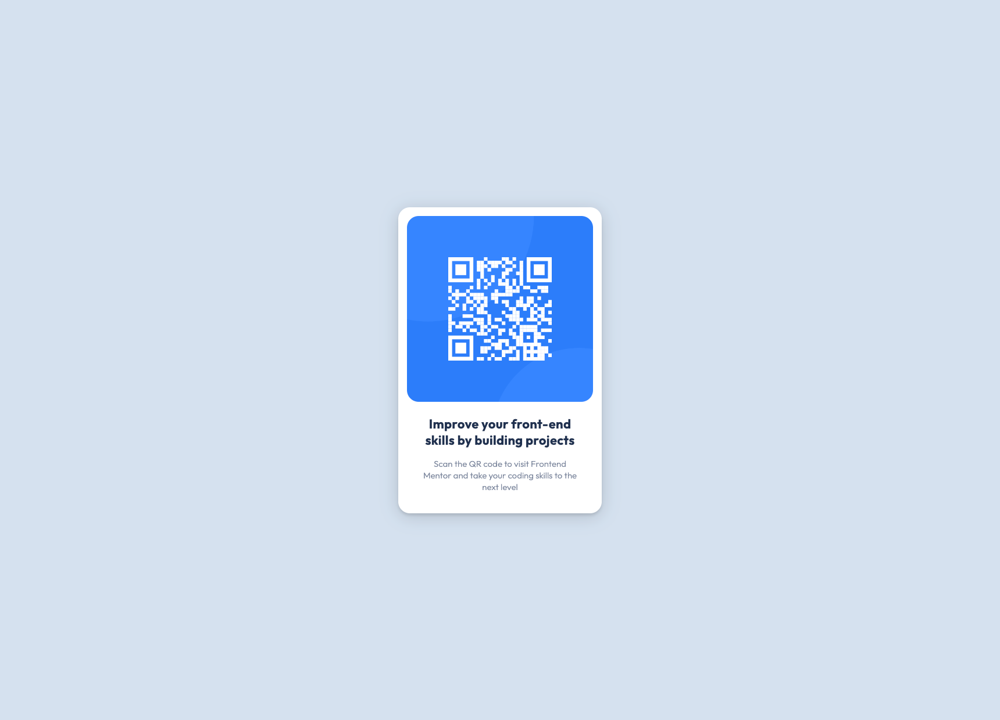

# Frontend Mentor - QR code component solution

This is a solution to the [QR code component challenge on Frontend Mentor](https://www.frontendmentor.io/challenges/qr-code-component-iux_sIO_H). Frontend Mentor challenges help you improve your coding skills by building realistic projects.

## Table of contents

- [Screenshot](#screenshot)
- [Links](#links)
- [Built with](#built-with)
- [Author](#author)

### Screenshot

### Links

- Solution URL: [frontendmentor.io](https://www.frontendmentor.io/solutions/responsive-qr-code-component-k-5TZj6VKg)
- Live Site URL: [cancirkin.github.io](https://cancirkin.github.io/qr-code-frontend-mentor/)

### Built with

- Semantic HTML5 markup
- CSS custom properties
- Flexbox
- Mobile-first workflow

## Author

- Frontend Mentor - [@cancirkin](https://www.frontendmentor.io/profile/cancirkin)
- Twitter - [@hcancirkin](https://www.twitter.com/hcancirkin)
